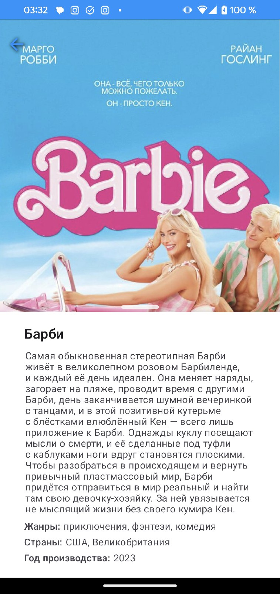
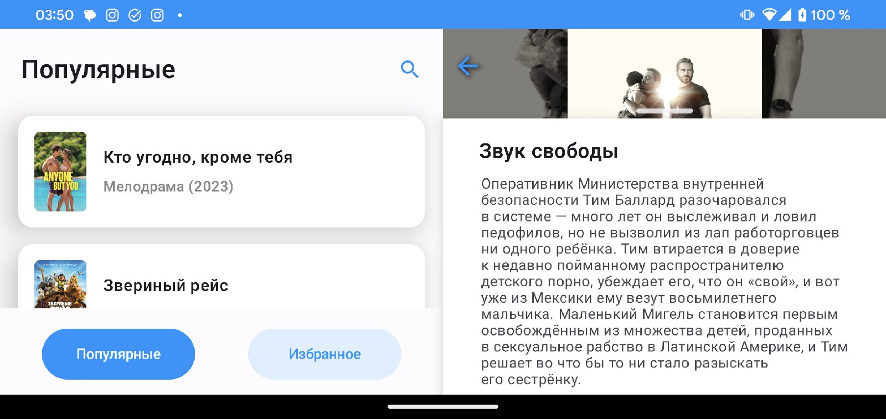
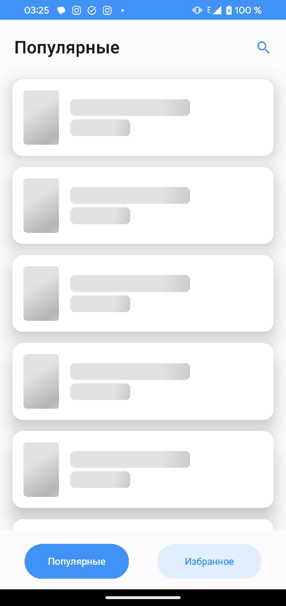
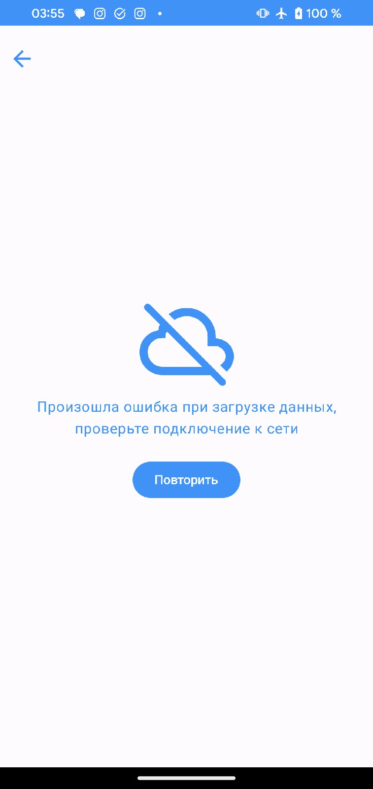
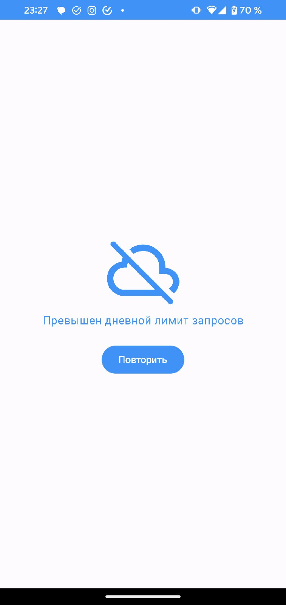
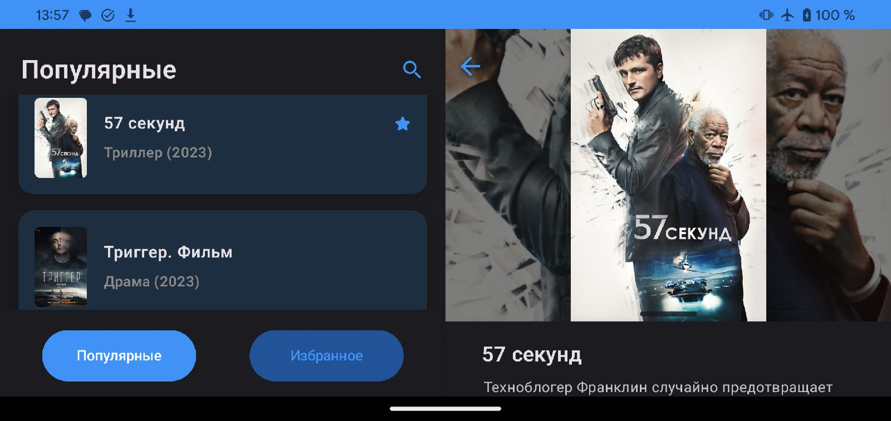

# Приложение для поиска фильмов на кинопоиске
Данное приложение позволяет просматривать популярные фильмы с сайта Кинопоиск, используя [неофициальное апи](https://www.kinopoiskapiunofficial.tech/)
Сделано по техническому заданию Тинькофф Финтех за 2.5 дня, дизайн был предоставлен в техническом задании (в фигме)
# Возможности
### Просмотр популярных фильмов и добавление понравившихся фильмов в избранные посредством долгого тапа по карточке
   
### Просмотр подробной информации о фильме, постера  
   
### Поиск по разделам  
   
### Адаптивный UI с анимацией при открытии фильма (идеально для планшетов)  
  
  
  

### Кэширование  
Приложение кэширует в БД и памяти загруженные ранее фильмы из разделов "популярные" и "избранное" (постеры и список фильмов), постеры в высоком разрешении и описания фильмов (а также год, жанр и прочее),
которые были открыты ранее или добавлены в избранное (при добавлении фильмов в избранное постер и описание предзагружаются, таким образом, всю информацию о фильмах из избранного: описание, постер в высоком разрешении, можно получить вообще без интернета)  
  

### Шиммеринг  
    

### Корректный хэндлинг ошибок  
    

### Поддержка тёмной темы  
  

# Архитектура  
В качестве архитектуры выбрана Clean Architecture с MVVM. Экраны взаимодействуют в вью-моделями, которые, в свою очередь, общаются с абстрактными репозиториями, реализация которых находится в data-слое.
Репозитории занимаются как кэшированием, так и получением данных с сервера, таким образом, пользователю при долгой загрузке сначала возвращается информация из кэша, а потом - информация из remote-источника. 
Приложение максимально реактивно: используются Kotlin Flows и стейты. Сущности типа DTO, Model и Entity разделены для максимальной гибкости при дальнейшей поддержке. Все нужные зависимости создаются и инжектятся с помощью Dagger-hilt.
# Используемые технологии
* Jetpack Compose 
* Kotlin
* KotlinX Coroutines, Flows
* Retrofit
* Room
* Dagger-hilt
* Coil (кэширование и показ постеров)
# Unit-тесты
Слои domain и data покрыты юнит-тестами. Были протестированы:
* Тайп-конвертер Room-а и моя имплементация json converter-а
* Все методы трансформации из DTO в модели, из моделей в сущности Room
* Dao и Db объекты базы данных Room (была инстанцирована in-memory БД room)
* Интерфейс KinopoiskApi, реализуемый Retrofit-ом (был использован MockWebServer)
* Кастомный аутентификатор - interceptor OkHTTP (также был протестирован с использованием MockWebServer)
* Репозиторий фильмов FilmRepository: были протестированы все методы, корректность данных, отправляемых во Flow репозиторием. В качестве источников данных использованы предварительно реализованные моки интерфейса Api и in-memory БД Room
* Ивенты навигации (NavigationEvent): проверена корректность конструируемого пути для Navigation Compose

